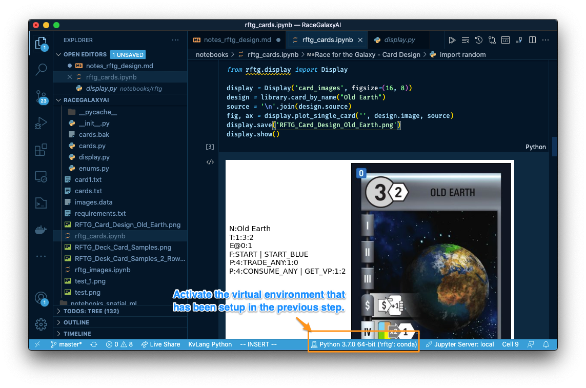

## Game Architecture for Card AI (Part 1)
This is a companion notebook for the blog post on [Game Architecture for AI (Part 1)](http://bennycheung.github.io/game-architecture-card-ai-1).

### Race for the Galaxy
* <a name="Jones09">[[Jones09]](https://boardgamegeek.com/thread/438698/article/3878167?fbclid=IwAR1KXYI1li66vhPBPwzwNfr8Tvg2Giz5zN5eXpVaugtCQe8DLUbILjzBMUE#3878167)</a> Keldon Jones, Talk a bit about how the AI works, Sep 2009
  * Latest Source Code 0.9.5, with all expansions <https://github.com/bnordli/rftg>
* <a name="Tesauro95">[[Tesauro95]](https://bkgm.com/articles/tesauro/tdl.html)</a> Gerald Tesauro, Temporal Difference Learning and TD-Gammon, Communications of the ACM, March 1995 / Vol. 38, No. 3
* <a name="TempleGates17">[[TemplateGates17]](https://www.templegatesgames.com/race-for-the-galaxy-ai/)</a> Race for the Galaxy AI, Temple Gates, Dec 2017
  * Temple Gates is the game developer for the App version that using Keldon Jone's AI engine

> We did not include the card images due to the legal distribution's restriction. You can download directly from Keldon Jones's original source distribution to find `images.data` file.

### LEGAL
Rio Grande Games holds the copyrights for the images. Permission to distribute the card and goal images has been granted by Rio Grande Games. The image files may not be unpacked or redistributed without this notice, or used for any other purpose.

## <a name="PythonDevelopment"></a> RFTG Python Development
Using an isolated Python virtual environment is standard Python development and deployment practice, to achieve envrironment isolation to avoid conflicts.
One of the choice are (1) `virtualenv` and `virtualenvwrapper` but we could choose an alternative such as (2) Anaconda (`conda` for short).

### <a name="VirtualEnv"></a> virtualenv & virtualenvwrapper
Here’s how to install virtualenv and virtualenvwrapper, both of which will live in the system site-packages and manage each project’s virtual environment site-packages:

```sh
pip install virtualenv virtualenvwrapper
```

We first need to add some lines to your `~/.bashrc` profile.
Open the editor to append these lines to the end:

```sh
# virtualenv and virtualenvwrapper
export WORKON_HOME=$HOME/.virtualenvs
export VIRTUALENVWRAPPER_PYTHON=/usr/bin/python3
source /usr/local/bin/virtualenvwrapper.sh
```

#### Anaconda virtualenv
Alternatively (MacOS or Windows), using [Anaconda](https://www.anaconda.com/) virualenv, enter the following, where `rftg` is the name of the virtual environment,
and `python=3.7` is the Python version to use.

```bash
conda create -n rftg python=3.7
```

Press y to proceed. This will install the Python version and all the associated anaconda packaged libraries at `{path_to_anaconda_location}/envs/rftg`

Once the `rftg` virtual environment has been installed, activate the virtualenv by

```bash
source activate rftg
```

### <a name="Dependencies"></a> Development Dependencies
Once the virtual environment `rftg` is activated, the module dependencies in `requirements.txt` must be installed.

```
pip install -r requirements.txt
```

### <a name="Notebook"></a> Jupyter Notebook Experiments
The development experiments are recorded in the Jupyter Notebook `rftg_cards.ipynb` to quickly run the code samples.
Inside Visual Studio code, install the Microsoft's "Jupyter" extension. When activate the `rftg_cards.ipynb` inside VScode, change the Python kernel to use `rftg` that has been setup in the previous steps.



